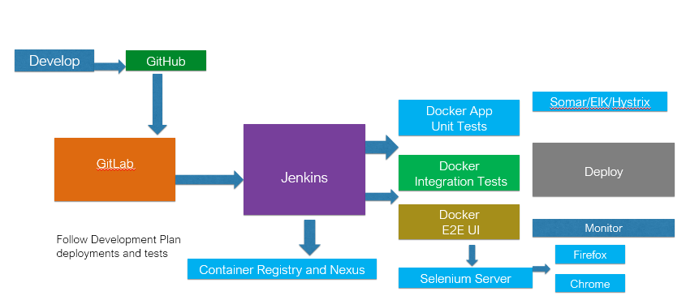

# CI Tools Demo

This GitHub repository contains Dockerfiles for running a set of Continuous Integration Tools with a single command. The diagram contains all tools used in the Docker containers.

# Notes

tools
VM Ubuntu 16.04
Docker
Docker-Compose

GitBash
VSTS Code
Tight VNC
Putty
WinScp

Chrome Plugins
Selenium Object Finder
Page Object Generator
Firefox
Selenium Builder 3

Hystrix
SonarQube
Portainer
Gitlab
Jenkins
Nexus
Selenium Hub
Selenium Nodes
Postgres

ELK
DockBeat
FileBeat

NewRelic - Server Infrastructure Monitoring
App Monitoring